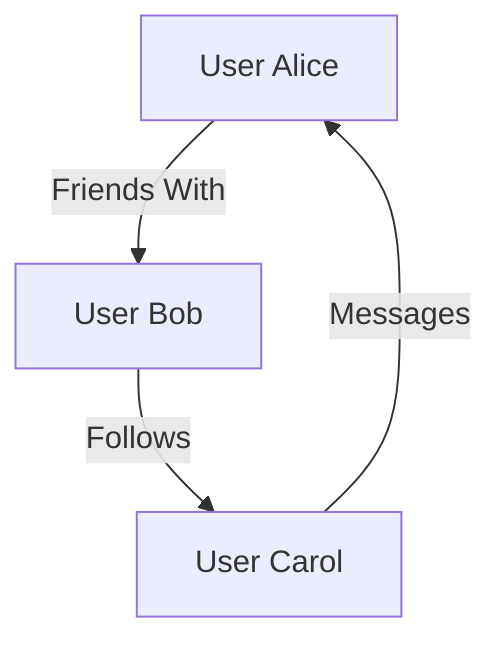
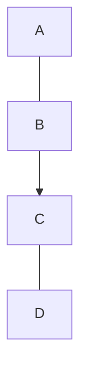
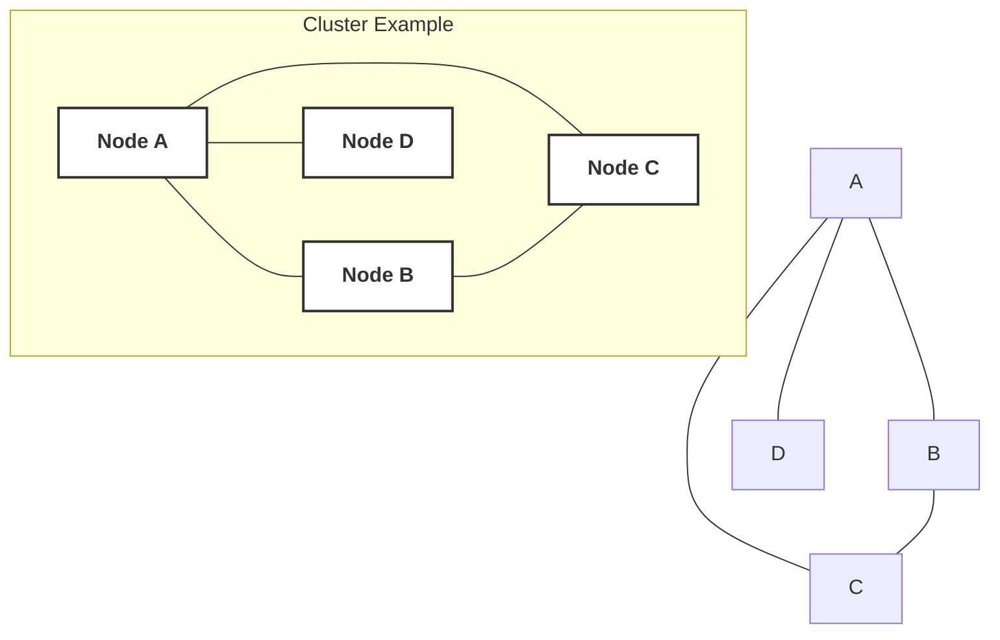
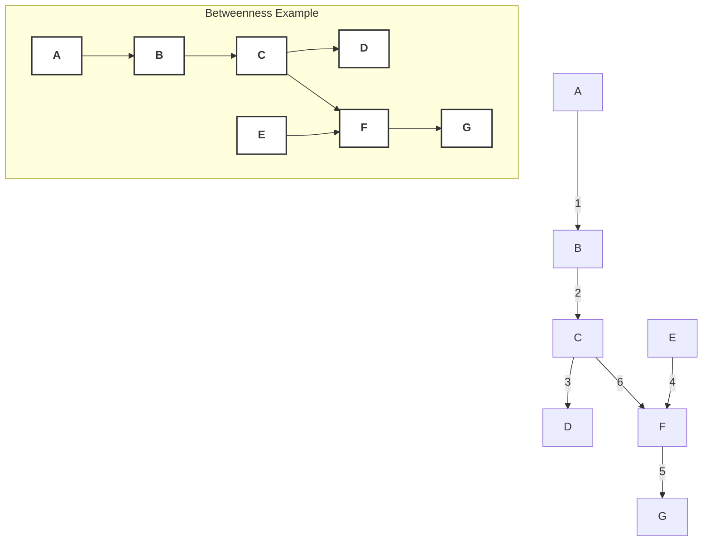
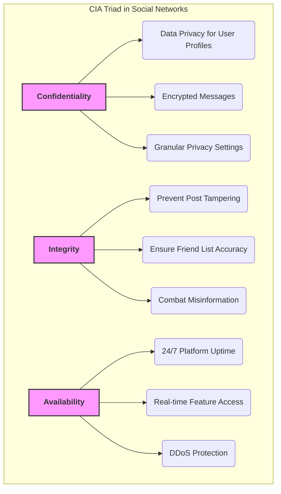

## Social Network Security: A Comprehensive Masterclass

### Overall Learning Outcomes:

  * **🧠 Understand the foundational mathematical and computational models** that underpin all social networks.
  * **🔐 Grasp why social networks are unique and high-value security targets**, and the specific threats they face.
  * **🛡 Apply core cybersecurity principles (CIA Triad)** within the context of social networks.
  * **💬 Articulate complex SNS concepts and security challenges** for academic and professional interviews.
  * **🧱 Build secure and robust social network features** in Java and Spring Boot.
  * **📚 Excel in Anna University's "Social Network Security" elective** by mastering the syllabus topics.

-----

## Module 1: Social Network Models - The Blueprint of Connection

To secure a social network, you must first understand its fundamental structure. This begins with **Graph Theory**, the mathematical language of networks.

### 📘 Theory & Concepts: Graph Theory Basics

A social network is, at its core, a **graph**. A graph is a mathematical structure used to model pairwise relations between objects.

  * **Nodes (Vertices):** These are the individual entities or actors within the network.

      * **In SNS Context:** A **user profile** (e.g., your Facebook account, a Twitter handle, a LinkedIn connection). Each user is a node.
      * **Visual Analogy:** Imagine each person in a room as a node.

  * **Edges (Links/Ties):** These represent the relationships or interactions between nodes.

      * **In SNS Context:**
          * A **"friend" connection** on Facebook.
          * A **"follow" relationship** on Twitter/Instagram.
          * A **"message" exchanged** between two users.
          * A **"like" on a post**.
          * A **"share" or "retweet"**.
      * **Visual Analogy:** The handshake, conversation, or shared activity between people in that room forms an edge.

-----

### 🔁 Diagrammatic Explanation: Basic Graph Elements



  * **Node:** A, B, C are nodes.
  * **Edge:** The lines connecting A-B, B-C, C-A are edges.

-----

#### Directed vs. Undirected Graphs

The nature of the relationship dictates the type of edge.

  * **Undirected Graphs:**

      * Edges have no direction. If Node A is connected to Node B, then Node B is implicitly connected to Node A.
      * **In SNS Context:** Symmetrical relationships.
          * **Facebook Friend:** If Alice is friends with Bob, Bob is automatically friends with Alice. This is typically represented as an **undirected edge**.
      * **Visual Analogy:** A two-way street where traffic flows in both directions.

  * **Directed Graphs:**

      * Edges have a specific direction. An edge from Node A to Node B does not necessarily imply an edge from B to A.
      * **In SNS Context:** Asymmetrical relationships.
          * **Twitter Follow:** Alice follows Bob (A → B), but Bob might not follow Alice (B \<binary data, 1 bytes\>\<binary data, 1 bytes\> A). This is a **directed edge**.
          * **Message:** Alice sends a message to Bob (Alice → Bob).
          * **Mention/Tag:** Alice mentions Bob in a post (Alice → Bob's profile).
      * **Visual Analogy:** A one-way street.

-----

### 🔁 Diagrammatic Explanation: Directed vs. Undirected

```mermaid
graph TD
    subgraph Undirected Graph (e.g., Facebook Friends)
        U1[Alice] --- U2[Bob]
        U2 --- U3[Carol]
    end

    subgraph Directed Graph (e.g., Twitter Follows)
        D1[Alice] --> D2[Bob]
        D3[Carol] --> D1
        D2 -.-> D3
    end
```

-----

#### Graph Representations: How to Store a Network

Computers need efficient ways to store and manipulate graph data.

1.  **Adjacency Matrix:**

      * **Concept:** A square matrix (NxN, where N is the number of nodes) where each cell `M[i][j]` indicates whether an edge exists between node `i` and node `j`.
          * `M[i][j] = 1` if an edge exists (or the weight of the edge).
          * `M[i][j] = 0` if no edge exists.
      * **For Undirected Graphs:** The matrix is symmetric (`M[i][j] = M[j][i]`).
      * **For Directed Graphs:** The matrix is asymmetric (`M[i][j]` does not necessarily equal `M[j][i]`).
      * **Pros:** Fast for checking if an edge exists (`O(1)`). Simple to implement.
      * **Cons:** Space-inefficient for "sparse" graphs (graphs with few edges relative to the number of nodes), as most entries will be zero. Social networks are often sparse (you're friends with few people compared to total users).
      * **Visual Analogy:** A grid-like seating chart where you mark "yes" or "no" if two people are talking.

2.  **Adjacency List:**

      * **Concept:** An array (or hash map) where each index `i` corresponds to node `i`, and the value at that index is a list of all nodes directly connected to node `i`.
      * **For Undirected Graphs:** If `j` is in `i`'s list, `i` is also in `j`'s list.
      * **For Directed Graphs:** If `j` is in `i`'s list, `i` is not necessarily in `j`'s list.
      * **Pros:** Space-efficient for sparse graphs (stores only existing edges). Efficient for finding all neighbors of a node.
      * **Cons:** Checking if an edge exists between two specific nodes can be slower (`O(degree)` of the node).
      * **Visual Analogy:** A list next to each person's name, detailing who they are talking to.

-----

### 🔁 Diagrammatic Explanation: Graph Representations

**Example Graph:**
Nodes: A, B, C, D
Edges: A-B (undirected), B-C (directed B-\>C), C-D (undirected)



**Adjacency Matrix (Directed, for simplicity considering all edges as potentially directed):**

|   | A | B | C | D |
|---|---|---|---|---|
| A | 0 | 1 | 0 | 0 |
| B | 1 | 0 | 1 | 0 |
| C | 0 | 0 | 0 | 1 |
| D | 0 | 0 | 1 | 0 |

*(Note: In a true undirected graph represented this way, the matrix would be symmetric. Here, for A-B, both M[A][B] and M[B][A] are 1. For B-\>C, only M[B][C] is 1.)*

**Adjacency List:**

  * **A:** [B]
  * **B:** [A, C]
  * **C:** [B (if undirected), D] (More precisely, if B-\>C, then for C, B is an "in-neighbor". For undirected C-D, D is a neighbor.)
      * For Directed: A: [B], B: [C], C: [D], D: []
      * For Undirected (modified graph with A-B, B-C, C-D all undirected):
          * A: [B]
          * B: [A, C]
          * C: [B, D]
          * D: [C]

-----

### 📘 Theory & Concepts: User Interaction Models

Beyond just the structure, understanding *how* users interact provides insights into network dynamics and potential security vulnerabilities.

1.  **Reciprocity (Mutual Follow/Friend):**

      * **Definition:** The tendency for relationships to be reciprocated. If A connects to B, B is likely to connect back to A.
      * **In SNS Context:**
          * Highly prevalent in "friend" networks (Facebook, LinkedIn connections) where relationships are symmetric by design.
          * Less prevalent in "follow" networks (Twitter, Instagram) where one-way relationships are common, but reciprocity still indicates a stronger tie.
      * **Security Relevance:**
          * **Trust:** Mutual connections often imply a higher degree of trust, making these links valuable for social engineering or phishing if compromised.
          * **Anomaly Detection:** A sudden drop in reciprocity within a user's network could indicate account compromise or spamming behavior (e.g., bot accounts often follow many but are followed by few).

2.  **Homophily ("Birds of a Feather Connect"):**

      * **Definition:** The principle that individuals with similar characteristics (age, interests, beliefs, location, education) are more likely to form connections with each other. "Like attracts like."
      * **In SNS Context:**
          * Facebook "People You May Know" suggestions often leverage homophily.
          * Users in gaming communities connect with other gamers.
          * Political groups coalesce around shared ideologies.
      * **Security Relevance:**
          * **Targeted Attacks:** Attackers can exploit homophily to create highly effective phishing campaigns (e.g., targeting members of a specific professional group with a fake job offer).
          * **Echo Chambers/Filter Bubbles:** While not directly a security flaw, the formation of homophilous groups can be exploited for misinformation or propaganda dissemination, impacting information integrity.
          * **Predictive Analytics for Malicious Accounts:** Identifying accounts that disproportionately connect with dissimilar users might flag botnets or malicious actors attempting to infiltrate diverse groups.

3.  **Social Influence and Network Effects:**

      * **Social Influence:** The degree to which one user's behavior or opinions affect another's.
      * **Network Effects:** The phenomenon where the value of a product or service increases as more people use it (e.g., a social network becoming more useful as more of your friends join).
      * **Viral Spread (Contagion):** How information, trends, or even malware can propagate rapidly through a network.
          * **Simple Contagion:** Requires only one exposure (e.g., seeing a trending topic).
          * **Complex Contagion:** Requires multiple exposures or social reinforcement (e.g., adopting a new political stance).
      * **Influence Maximization:** The problem of identifying a small set of highly influential nodes in a network whose activation would maximize the spread of influence.
      * **In SNS Context:**
          * Hashtags trending on Twitter.
          * Viral challenges on TikTok.
          * Opinion formation in online communities.
      * **Security Relevance:**
          * **Malware/Phishing Dissemination:** Attackers leverage viral spread to quickly distribute malicious links or content (e.g., "click this link to see who viewed your profile").
          * **Misinformation/Disinformation Campaigns:** Malicious actors identify and target influential nodes (e.g., popular users, journalists) to spread propaganda or fake news, impacting information integrity and availability.
          * **Botnet Orchestration:** Bots can mimic social influence to amplify messages or create artificial trends.
          * **Understanding Spread:** Security analysts can use network models to predict and mitigate the spread of threats by identifying "super-spreaders" or critical paths.

-----

### 📘 Theory & Concepts: Network Properties

These metrics help us understand the overall structure and health of a social network, and identify key nodes.

1.  **Degree, In-degree, Out-degree:**
      * **Degree (for Undirected Graphs):** The number of edges connected to a node. It simply measures the number of direct connections a node has.
          * **In SNS Context:** Number of friends a user has on Facebook.
      * **In-degree (for Directed Graphs):** The number of incoming edges to a node.
          * **In SNS Context:** Number of people who follow a Twitter user; number of messages received.
      * **Out-degree (for Directed Graphs):** The number of outgoing edges from a node.
          * **In SNS Context:** Number of people a Twitter user follows; number of messages sent.
      * **Security Relevance:**
          * **High Degree/In-degree:** Potential targets for account takeover (high impact if compromised) or hubs for information spread (both legitimate and malicious).
          * **Unusually High Out-degree (especially for new accounts):** A common indicator of bot accounts or spamming activity.
          * **Analyzing Degree Distribution:** Can help identify "power users" vs. "fringe users" and potential vulnerabilities in network structure.

-----

### 🔁 Diagrammatic Explanation: Degree Measures

```mermaid
graph TD
    A -- 1 --> B
    B -- 2 --> C
    D -- 3 --> B

    style A fill:#fff,stroke:#333,stroke-width:2px,font-weight:bold
    style B fill:#fff,stroke:#333,stroke-width:2px,font-weight:bold
    style C fill:#fff,stroke:#333,stroke-width:2px,font-weight:bold
    style D fill:#fff,stroke:#333,stroke-width:2px,font-weight:bold

    subgraph Degrees (Directed Graph)
        dirA[A] --> dirB[B]
        dirB --> dirC[C]
        dirD[D] --> dirB

        linkStyle 0 stroke-width:0px;
        linkStyle 1 stroke-width:0px;
        linkStyle 2 stroke-width:0px;

        dirA -- "(Out-degree=1)" --> Z1
        dirA -- "(In-degree=0)" --> Z2
        dirB -- "(Out-degree=1)" --> Z3
        dirB -- "(In-degree=2)" --> Z4
        dirC -- "(Out-degree=0)" --> Z5
        dirC -- "(In-degree=1)" --> Z6
        dirD -- "(Out-degree=1)" --> Z7
        dirD -- "(In-degree=0)" --> Z8
    end
```

-----

2.  **Clustering Coefficient:**
      * **Concept:** Measures the degree to which nodes in a graph tend to cluster together. In other words, if A is friends with B and C, how likely are B and C to be friends with each other?
      * **Local Clustering Coefficient (for a single node):** The ratio of actual connections between a node's neighbors to the maximum possible connections between those neighbors.
      * **Global Clustering Coefficient:** The average of all local clustering coefficients, or a measure over the entire network.
      * **Formula (Local for node $v$):**
        $C\_v = \\frac{2 \\times \\text{number of triangles connected to } v}{\\text{degree}(v) \\times (\\text{degree}(v) - 1)}$
      * **In SNS Context:** Indicates how "tight-knit" a user's friend group is. High clustering means your friends are likely friends with each other.
      * **Security Relevance:**
          * **Community Strength:** High clustering indicates strong communities, which can be resistant to external influence but also vulnerable if a core member is compromised.
          * **Targeting:** Attackers might seek out nodes with low clustering coefficients to infiltrate otherwise isolated communities, acting as bridges.
          * **Anomaly Detection:** A sudden change in a user's clustering coefficient could indicate unusual activity or a new type of connection pattern (e.g., a legitimate user starting to connect with many unrelated, suspicious accounts).

-----

### 🔁 Diagrammatic Explanation: Clustering Coefficient



  * **Node A has neighbors B, C, D.**
  * **Maximum possible edges among neighbors:** (B,C), (B,D), (C,D) = 3 edges.
  * **Actual edges among neighbors connected to A:** (B-C) = 1 edge.
  * **Local Clustering Coefficient for A:** $C\_A = \\frac{2 \\times 1}{3 \\times (3 - 1)} = \\frac{2}{3 \\times 2} = \\frac{2}{6} = 0.33$

-----

3.  **Path Length and Network Diameter:**
      * **Path Length:** The number of edges in the shortest path between two nodes.
      * **Network Diameter:** The longest shortest path between any two nodes in the network. It's the "longest trip" you can take between any two people in the network, by shortest routes.
      * **"Six Degrees of Separation":** A famous concept suggesting that any two people in the world are connected by a chain of no more than six relationships. This implies a small world network structure, common in SNS.
      * **In SNS Context:** How "far apart" two users are in terms of connections.
      * **Security Relevance:**
          * **Spread Velocity:** Smaller path lengths and diameters mean information (or malicious content) can spread faster through the network.
          * **Targeted Influence:** Attackers can leverage short paths to reach a wide audience quickly.
          * **Understanding Reach:** Helps quantify how quickly a threat (e.g., a phishing campaign originating from a compromised account) can spread.

-----

### 📘 Theory & Concepts: Centrality Measures

Centrality measures identify the most "important" or "influential" nodes within a network, based on different criteria. These are crucial for understanding influence, vulnerability, and attack surfaces.

1.  **Degree Centrality:**

      * **Concept:** Simply the number of direct connections a node has (its degree, in-degree, or out-degree).
      * **Interpretation:** Nodes with high degree centrality are "connectors" or "popular" nodes. They have immediate reach.
      * **Formula (Normalized for Undirected Graph):** $C\_D(v) = \\frac{\\text{degree}(v)}{N-1}$ (where N is total nodes)
      * **In SNS Context:** Users with many friends/followers.
      * **Security Relevance:**
          * **High-Value Targets:** Accounts with high degree centrality are attractive targets for attackers due to their immediate reach and potential for spreading malicious content or gaining access to connected users.
          * **Bot Detection:** Bots might inflate their degree (out-degree especially) to appear legitimate or spread spam widely.

2.  **Betweenness Centrality:**

      * **Concept:** Measures the extent to which a node lies on the shortest paths between other nodes in the network. A node with high betweenness centrality acts as a "bridge" or "broker" for information flow.
      * **Interpretation:** These nodes are critical for connecting different parts of the network. Removing them can disrupt communication.
      * **Formula:** $C\_B(v) = \\sum\_{s \\neq v \\neq t} \\frac{\\sigma\_{st}(v)}{\\sigma\_{st}}$
          * $\\sigma\_{st}$: number of shortest paths between nodes $s$ and $t$.
          * $\\sigma\_{st}(v)$: number of shortest paths between $s$ and $t$ that pass through $v$.
      * **In SNS Context:** A user who connects two otherwise disconnected groups of friends (e.g., your friend who knows people from your work and your hobby group).
      * **Security Relevance:**
          * **Critical Points of Failure:** Compromising a high-betweenness node allows an attacker to observe or control information flow between multiple groups.
          * **Targeted Misinformation:** Ideal nodes for injecting misinformation to spread across diverse communities.
          * **Network Segmentation:** Identifying these nodes can help in designing security measures that prevent threats from jumping between segments.

-----

### 🔁 Diagrammatic Explanation: Betweenness Centrality



  * In this diagram, **Node C** and **Node F** would likely have high betweenness centrality because they bridge the left chain (A-B-C-D) and the right chain (E-F-G). If you remove C or F, the network might split or paths between A/D and E/G become much longer.

-----

3.  **Closeness Centrality:**

      * **Concept:** Measures how "close" a node is to all other nodes in the network. It's the inverse of the average shortest path length from a node to all other reachable nodes.
      * **Interpretation:** Nodes with high closeness centrality can quickly spread information to, or receive information from, the entire network. They are good "broadcasters."
      * **Formula (Normalized):** $C\_C(v) = \\frac{N-1}{\\sum\_{u \\neq v} d(v, u)}$
          * $d(v, u)$: shortest path distance between node $v$ and node $u$.
      * **In SNS Context:** A user who is "central" in the sense that they can reach anyone quickly, or be reached quickly by anyone.
      * **Security Relevance:**
          * **Rapid Dissemination:** Ideal targets for spreading awareness messages (e.g., security alerts) or, conversely, for spreading malware or disinformation quickly throughout the network.
          * **Anomaly Detection:** Sudden shifts in a user's average path length to others could indicate compromised account or new, unusual connections.

4.  **Eigenvector Centrality:**

      * **Concept:** Measures a node's influence based on the influence of its neighbors. A node is important if it is connected to other important nodes. It's a measure of influence in a network.
      * **Interpretation:** It's not just about how many connections you have, but how many *important* connections you have.
      * **Formula (Simplified Idea):** $C\_E(v) = \\frac{1}{\\lambda} \\sum\_{u \\in N(v)} C\_E(u)$ (where $N(v)$ are neighbors of $v$, and $\\lambda$ is a constant, eigenvector calculation).
      * **In SNS Context:** A social media influencer who is connected to other influencers; a celebrity who is followed by other celebrities.
      * **Security Relevance:**
          * **Highly Influential Targets:** Compromising an account with high eigenvector centrality allows an attacker to tap into a highly influential sub-network, making it effective for propaganda, social engineering, or large-scale scams.
          * **Detecting Influence Manipulation:** Can help identify bot accounts attempting to artificially inflate the influence of certain messages or individuals by creating networks of interconnected fake accounts.

-----

### 📘 Theory & Concepts: Community Detection Algorithms

Social networks are rarely monolithic; they often naturally form groups or clusters based on shared interests, geography, or relationships. Detecting these "communities" is crucial for understanding network structure and security.

  * **Community:** A group of nodes that are more densely connected to each other than to nodes outside the group.
  * **Purpose of Community Detection:**
      * Identify sub-groups within large networks.
      * Understand the modular structure of a network.
      * Analyze information flow and social dynamics.
      * Target interventions (e.g., security warnings, marketing).

<!-- end list -->

1.  **Girvan-Newman Algorithm (Edge Betweenness):**

      * **Concept:** This algorithm works by iteratively removing edges that have the highest "betweenness centrality." Edges that lie on many shortest paths between nodes are considered "bridges" between communities. Removing these bridges breaks the network into its constituent communities.
      * **Steps:**
        1.  Calculate the betweenness centrality for all edges in the network.
        2.  Remove the edge with the highest betweenness centrality.
        3.  Recalculate betweenness centralities for all remaining edges (as removing an edge changes shortest paths).
        4.  Repeat until no edges remain, or a desired number of communities are found.
        5.  The 'best' partitioning is often determined by maximizing a metric called **modularity**.
      * **Pros:** Intuitive, can reveal hierarchical community structure.
      * **Cons:** Computationally intensive, especially for large networks (`O(E*N)` or `O(N^3)` in dense graphs).

2.  **Louvain Method (Modularity Optimization):**

      * **Concept:** A greedy optimization algorithm that iteratively tries to maximize the network's "modularity." Modularity is a metric that quantifies the strength of division of a network into modules (communities). High modularity means dense connections within communities and sparse connections between communities.
      * **Steps:**
        1.  **Phase 1 (Initialization):** Each node is initially assigned to its own community.
        2.  **Phase 2 (Optimization):** For each node, it tries to move it to a neighbor's community. The move is made if it results in the greatest increase in modularity. This is repeated until no further modularity gains can be made by moving individual nodes.
        3.  **Phase 3 (Aggregation):** The identified communities are then treated as single "super-nodes," and a new network is built on these super-nodes. The algorithm then iterates on this new network (repeating Phase 2 and 3) until no further modularity increases are possible.
      * **Pros:** Very fast and efficient for large networks. Produces good quality partitions.
      * **Cons:** Can sometimes get stuck in local optima (though generally performs well).

#### Real examples: Community detection in Instagram, Twitter

  * **Instagram:** Identifying "fashion communities," "foodie groups," or "travel blogger circles" based on mutual follows, likes, and shared hashtags. This can help platforms recommend content or identify emerging trends.
  * **Twitter:** Detecting political echo chambers, fan groups for specific topics, or groups involved in coordinated disinformation campaigns. This is crucial for identifying and mitigating malicious network activity.
  * **LinkedIn:** Discovering professional groups, alumni networks, or industry-specific clusters.

-----

### 🔁 Diagrammatic Explanation: Community Detection

**Concept of Communities:**

```mermaid
graph TD
    subgraph Community 1
        A --- B
        A --- C
        B --- C
    end

    subgraph Community 2
        D --- E
        D --- F
        E --- F
    end

    C --- D % Link between communities
```

  * Here, (A, B, C) form one community, and (D, E, F) form another, with C-D acting as a bridge.

**Girvan-Newman (Conceptual):**

1.  Identify C-D as having high betweenness.
2.  Remove C-D.
3.  The network splits into two clear communities.

**Louvain Method (Conceptual):**

1.  Start with each node as its own community.
2.  Iteratively move nodes to increase modularity. A, B, C would gravitate together. D, E, F would gravitate together.
3.  The algorithm would converge on the two distinct communities.

-----

-----

## Module 2: Introduction to Social Network Security - The Battleground

Now that we understand the structure, let's explore why social networks are such prime targets for attackers and the fundamental security principles that apply.

### 🛡️ Introduction to Social Network Security

Social networks are complex ecosystems of personal data, interactions, and dynamic content, making them uniquely challenging and rewarding targets for various threat actors.

#### Why Social Networks Are Unique Security Targets

1.  **Vast Repository of Personal Identifiable Information (PII):**
      * SNS platforms collect an enormous amount of PII: names, birthdates, locations, phone numbers, email addresses, relationship statuses, education, work history, photos, interests, political views, religious affiliations, and even biometric data.
      * **Why Unique:** This concentration of diverse PII makes SNS a goldmine for identity theft, targeted advertising, surveillance, and social engineering.
2.  **Open APIs and Interconnectedness:**
      * Most social networks offer APIs for third-party applications to integrate (e.g., "Login with Facebook," Twitter bots, data analytics tools).
      * **Why Unique:** While enabling rich ecosystems, these APIs can introduce vulnerabilities if not rigorously secured. Misconfigurations or malicious third-party apps can create backdoors for data exfiltration.
3.  **User-Generated Data and Content Volume:**
      * SNS platforms are driven by user-generated content (UGC): posts, comments, messages, photos, videos.
      * **Why Unique:** The sheer volume and dynamic nature of UGC make it incredibly difficult to monitor for malicious content (spam, phishing, misinformation, hate speech) at scale. Attackers can embed malicious links, scripts, or propaganda within seemingly innocuous content.
4.  **Implicit Trust and Social Engineering:**
      * Users tend to trust information and requests coming from their "friends" or connections within the network.
      * **Why Unique:** This inherent trust is easily exploited by social engineering attacks (e.g., phishing links disguised as shared content from a friend, fake emergency pleas).
5.  **Network Effects and Rapid Information Spread:**
      * As discussed earlier, information (and threats) can spread virally through social networks.
      * **Why Unique:** This amplifies the impact of attacks. A single compromised account or piece of misinformation can reach millions in minutes.
6.  **Real-Time Nature:**
      * SNS platforms operate in real-time, with constant updates and interactions.
      * **Why Unique:** This continuous flow makes it challenging for security systems to detect and react to evolving threats quickly enough.

#### Examples of SNS Security Incidents:

  * **Cambridge Analytica Scandal (Facebook, 2018):**
      * **Incident:** A third-party app (a personality quiz) was granted access to user data, and crucially, the data of their friends, without explicit consent from those friends. This data (tens of millions of user profiles) was then used for political microtargeting.
      * **Lesson:** Demonstrated the immense privacy risks of poorly regulated third-party API access and the far-reaching consequences of data exploitation. Highlighted the power of social graph data.
  * **Facebook Scraping Incidents (e.g., 2021 Data Leak):**
      * **Incident:** Publicly available user data (names, phone numbers, email addresses) from over 533 million Facebook users was scraped and leaked online. While some data was public, the aggregation made it valuable. This was often done via vulnerabilities in features like "contact importer."
      * **Lesson:** Showed the danger of data scraping, even for "public" data, when aggregated. Emphasized the need for robust rate limiting and protections against automated data collection.
  * **Impersonation Attacks:**
      * **Incident:** Attackers create fake profiles mimicking legitimate users (e.g., a CEO, a public figure, or a regular user's friend) to deceive others, spread misinformation, or conduct phishing.
      * **Lesson:** Highlights the importance of identity verification, robust reporting mechanisms, and user education against trusting unverified profiles.

-----

#### Types of Data in SNS

The sheer variety and volume of data make SNS a complex security target.

1.  **User Profiles:**
      * **What:** Name, age, gender, date of birth, current city, hometown, education history, work history, relationship status, political views, religious beliefs, sexual orientation, interests, website links.
      * **Sensitivity:** High PII, valuable for identity theft, targeted advertising, social engineering, and surveillance.
2.  **Posts (Text, Image, Video):**
      * **What:** Status updates, shared articles, photos, videos, stories, comments on other content. Includes the content itself and associated metadata (timestamps, location tags, hashtags, mentions).
      * **Sensitivity:** Can contain PII, private thoughts, location information, images of individuals. Can be used for targeted harassment, doxing, or spreading misinformation.
3.  **Messages (Private, Group):**
      * **What:** Direct messages (DMs) between individuals, group chats.
      * **Sensitivity:** Often contain highly confidential and private communications, sensitive personal or business information, media. **Highest confidentiality requirement.**
4.  **Photos, Metadata, and Geo-location Info:**
      * **What:** Images and videos uploaded by users. Metadata often embedded in photos (EXIF data) can include camera model, date/time taken, and precise GPS coordinates if not stripped by the platform. Check-ins, location tags in posts.
      * **Sensitivity:** Extremely high. Can reveal precise living/working locations, daily routines, social circles, and specific events, making users vulnerable to physical threats, stalking, or targeted exploitation.

-----

#### 🛡 Security Principles: CIA Triad in SNS

The foundational principles of information security – **Confidentiality, Integrity, and Availability (CIA Triad)** – are paramount in social networks.

1.  **Confidentiality:**

      * **Definition:** Protecting information from unauthorized access and disclosure. Ensuring only authorized individuals can view sensitive data.
      * **In SNS Context:**
          * **User Private Data:** Ensuring private messages, unshared photos, and sensitive profile information (like phone numbers) are only accessible by the intended recipient or the user themselves.
          * **Access Control:** Implementing robust access control mechanisms so users can only view data they are authorized to see (e.g., only friends can see certain posts, only group members can see group content).
          * **Data Encryption:** Encrypting data both in transit (HTTPS/TLS) and at rest (database encryption) to prevent eavesdropping and unauthorized access.
      * **Threats:** Data breaches, unauthorized access, passive eavesdropping, data scraping, compromised accounts.
      * **Mitigation:** Strong authentication (MFA), granular access control (privacy settings), data encryption, secure API design, strict third-party app permissions, regular security audits.

2.  **Integrity:**

      * **Definition:** Protecting information from unauthorized modification or destruction. Ensuring data is accurate, complete, and trustworthy.
      * **In SNS Context:**
          * **Content Authenticity:** Preventing unauthorized modification of posts, comments, friend lists, or profile information (e.g., someone changing your status update, adding fake friends to your list).
          * **Trust in Information:** Ensuring the information displayed on the platform is not tampered with, whether by malicious users or internal errors. Combatting misinformation.
          * **Code Integrity:** Ensuring the application code itself hasn't been maliciously altered.
      * **Threats:** Website defacement, data tampering, fake news/disinformation, unauthorized deletion, profile hijacking.
      * **Mitigation:** Input validation and output encoding (preventing XSS, SQLi), digital signatures for critical data, strict access control for content modification, versioning of content, robust moderation tools, anomaly detection for content changes.

3.  **Availability:**

      * **Definition:** Ensuring that authorized users have continuous and reliable access to information and resources when needed.
      * **In SNS Context:**
          * **Platform Uptime:** Keeping the social network accessible 24/7, even under heavy load.
          * **Real-time Access:** Ensuring users can post, message, and interact in real-time without significant delays.
          * **Resource Accessibility:** Ensuring features like news feeds, messaging, and profile viewing load promptly.
      * **Threats:** Denial of Service (DoS/DDoS) attacks, server outages, infrastructure failures, resource exhaustion.
      * **Mitigation:** Robust infrastructure (load balancing, failover, redundancy), DDoS protection services, rate limiting on APIs, efficient resource management, regular maintenance and patching, robust backup and recovery plans.

-----

### 🔁 Diagrammatic Explanation: CIA Triad in SNS



-----

#### Threat Actors and Their Motivations

Understanding *who* is attacking and *why* is crucial for effective defense.

1.  **Hackers (Individual/Groups):**

      * **Motivations:**
          * **Fame/Recognition:** Hacking for bragging rights, demonstrating skill.
          * **Financial Gain:** Selling compromised accounts, PII, or access to data.
          * **Ideology/Activism (Hacktivism):** Disrupting services or leaking data to protest or promote a cause.
          * **Personal Grudge:** Targeting specific individuals or organizations.
      * **Tactics:** Exploiting known vulnerabilities (SQLi, XSS), social engineering, phishing, brute-force attacks, credential stuffing.

2.  **Nation-States:**

      * **Motivations:**
          * **Surveillance:** Monitoring dissidents, foreign intelligence targets, or general populations.
          * **Propaganda/Influence Operations:** Spreading disinformation, influencing elections, shaping public opinion.
          * **Cyber Espionage:** Stealing intellectual property or sensitive government/corporate data.
          * **Cyber Warfare:** Disrupting critical infrastructure or social cohesion.
      * **Tactics:** Sophisticated phishing (spear phishing), zero-day exploits, advanced persistent threats (APTs), supply chain attacks, large-scale botnets, coordinated disinformation campaigns.

3.  **Data Brokers/Aggregators:**

      * **Motivations:**
          * **Profit:** Collecting vast amounts of publicly available (or semi-public) social media data to sell to marketers, advertisers, or other businesses for analytics and profiling.
      * **Tactics:** Large-scale automated data scraping, leveraging open APIs, sometimes exploiting loopholes in platform terms of service. (Cambridge Analytica is a prime example, though they went beyond "public" data.)

4.  **Marketers/Advertisers:**

      * **Motivations:**
          * **Targeted Advertising:** Gaining deep insights into user demographics, interests, and behaviors to deliver highly personalized ads.
          * **Audience Segmentation:** Identifying specific groups for product promotion.
      * **Tactics:** Legitimate use of platform analytics tools, but also sometimes ethically questionable data collection practices, or purchasing data from data brokers.

5.  **Social Engineers:**

      * **Motivations:**
          * **Deception for Access/Information:** Tricking users into revealing credentials, clicking malicious links, or performing actions beneficial to the attacker.
          * **Impersonation:** Pretending to be someone else to gain trust or exploit relationships.
      * **Tactics:** Phishing (via DMs, posts), pretexting, baiting, scareware, vishing (voice phishing). They leverage human psychology, trust, and urgency.

-----

### 🧠 Interview Q\&A + MCQs + Flashcards:

**Q\&A:**

  * **Q:** What is the primary difference between Degree Centrality and Betweenness Centrality in a social network? Why does this matter for security?
      * **A:** Degree Centrality measures direct connections (popularity/reach). Betweenness Centrality measures how often a node lies on the shortest path between other nodes (bridge/broker). For security, high-degree nodes are attractive targets due to their broad audience, while high-betweenness nodes are critical points of failure, enabling attackers to control information flow or segment parts of the network if compromised.
  * **Q:** Explain the concept of "Homophily" in social networks and how it could be exploited by attackers.
      * **A:** Homophily is the tendency for people to connect with others who are similar to them. Attackers can exploit this by crafting highly targeted phishing messages or misinformation campaigns designed to appeal to the specific characteristics or interests of a homophilous group, making the attacks more believable and effective.
  * **Q:** How does the "CIA Triad" apply specifically to direct messaging features in a social network?
      * **A:**
          * **Confidentiality:** Ensuring only sender and recipient can read messages (e.g., end-to-end encryption).
          * **Integrity:** Preventing messages from being altered in transit or at rest without detection.
          * **Availability:** Ensuring messages can be sent and received promptly and reliably, even during peak usage.
  * **Q:** Why are "user-generated data" and "network effects" particularly challenging for social network security teams?
      * **A:** User-generated data is difficult to moderate at scale for malicious content. Network effects mean that any malicious content or compromise can spread virally and rapidly, amplifying the impact before security teams can react.

**MCQs:**

1.  Which graph representation is most space-efficient for sparse social networks?

      * a) Adjacency Matrix
      * b) Adjacency List
      * c) Incidence Matrix
      * d) Edge List
      * **Answer: b) Adjacency List**

2.  A Twitter user who follows 100,000 accounts but is followed by only 50 accounts would likely have a very high:

      * a) In-degree
      * b) Closeness Centrality
      * c) Out-degree
      * d) Clustering Coefficient
      * **Answer: c) Out-degree**

3.  The Cambridge Analytica scandal primarily highlighted security risks related to:

      * a) DDoS attacks
      * b) SQL Injection
      * c) Third-party API access and data privacy
      * d) Brute-force attacks
      * **Answer: c) Third-party API access and data privacy**

4.  Protecting a user's private photos from being viewed by unauthorized individuals falls under which aspect of the CIA Triad?

      * a) Integrity
      * b) Availability
      * c) Confidentiality
      * d) Non-repudiation
      * **Answer: c) Confidentiality**

**Flashcards:**

  * **Front:** What is a "node" in a social network graph?
      * **Back:** An individual entity or actor, typically a user profile.
  * **Front:** Define "Betweenness Centrality."
      * **Back:** A measure of how often a node lies on the shortest path between other nodes, indicating its role as a "broker" or "bridge."
  * **Front:** What is the primary goal of the Louvain Method for community detection?
      * **Back:** To maximize the network's modularity, identifying densely connected groups within the network.
  * **Front:** Give an example of a security threat to "Integrity" in an SNS.
      * **Back:** An unauthorized person altering your post or friend list; the spread of misinformation/fake news.
  * **Front:** What specific data type in SNS carries the highest confidentiality requirement?
      * **Back:** Private messages (Direct Messages).

-----

### 🗂️ Anna University Mapping to “Social Network Security” syllabus (Reg 2021)

This content maps directly to the initial foundational units of your "Social Network Security" elective:

  * **Unit I: Introduction to Social Networks:**
      * **Graph Theory Basics (Nodes, Edges, Directed/Undirected Graphs, Adjacency Matrix/List):** This is the fundamental language for describing social networks.
      * **User Interaction Models (Reciprocity, Homophily, Social Influence, Network Effects):** These explain the behavioral dynamics within social networks.
      * **Network Properties (Degree, Clustering Coefficient, Path Length, Diameter, Centrality Measures):** These are quantitative metrics used to analyze network structure and identify key actors.
      * **Community Detection Algorithms (Girvan-Newman, Louvain Method):** These are techniques to identify inherent groupings within the network.
  * **Unit II: Social Network Security Fundamentals:**
      * **Why Social Networks Are Unique Security Targets:** Directly addresses the inherent vulnerabilities and attractiveness of SNS.
      * **Types of Data in SNS:** Details the sensitive data residing on these platforms.
      * **CIA Triad in SNS:** Applies the core security principles to the SNS context.
      * **Threat Actors and Their Motivations:** Identifies the adversaries and their objectives.

This initial deep dive provides a robust theoretical foundation. In subsequent modules, we will delve into practical implementations, tools, specific attacks, and advanced security considerations for Java full-stack development.
